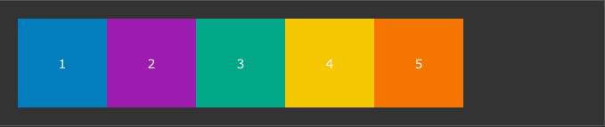
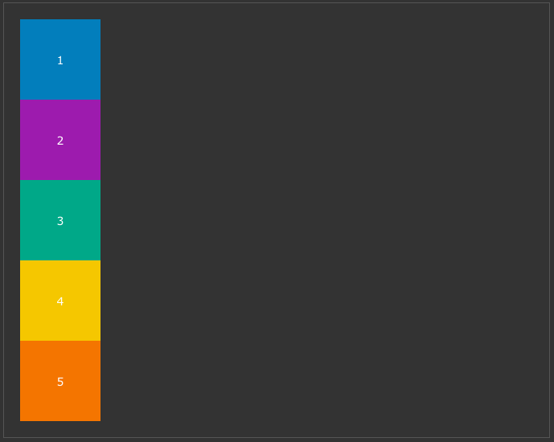

## Why use media queries ?

You'll **mainly** be using media queries when you want certain 
CSS rules to apply **only** for a specific screen width (a.k.a Responsive Design).

Let's say you're rendering several divs using `flexbox`. With a large screen, 
you want to them to be rendered one next to each other (`flex-direction: row`). However, for smaller screens 
(smartphones), you want the divs to be rendered on on top of the other (`flex-direction: column`).

### Here's what this looks like using CSS media queries
```css
.container {
    display: flex;
    flex-direction: row;
}
```



```css
/* 
  ##Device = Most of the Smartphones Mobiles (Portrait)
  ##Screen = B/w 320px to 479px
*/
@media (min-width: 320px) and (max-width: 480px) {
  .container {
      flex-direction: column;
  }
}
```



### How does it work ?

Inside a `.css` file, a media query starts with the keyword `@media`. 
You can then define *media features*, which describes specific characteristic of the device or environment. Most of 
the time, the styling you'll want to apply in a media query will depend on the browser's viewport width. Thus, 
the most used *media features* are `max-width` and `min-width`. Imagine the *media features* as conditions that have to
be true if you want the following CSS to be applied. 

If you wish to know more about the other *media features*, I recommend checking the MDN docs (link at the bottom of 
the article).

In the example above, the default behaviour for the element with `class="container"` is to be displayed in row.
Then, we define a media query that will depend on the viewport's with. Between 320 and 479px, a new CSS rule
will overwrite the default behaviour, replacing `flex-direction: row` with `flex-direction: column`.

## Learn more about flexbox

This article covers 90% of the problems you'll be solving with media queries, 
and I mainly wrote it because I have to search **every single time** the syntax to
do a media query. I just hope that after writing an article about it, no more googling will be
involved.

Here are some great resources if you wish to learn more about media queries :
 
- [MDN Docs](https://developer.mozilla.org/en-US/docs/Web/CSS/Media_Queries)
- [Choose the right CSS Breakpoints](https://gist.github.com/gokulkrishh/242e68d1ee94ad05f488)