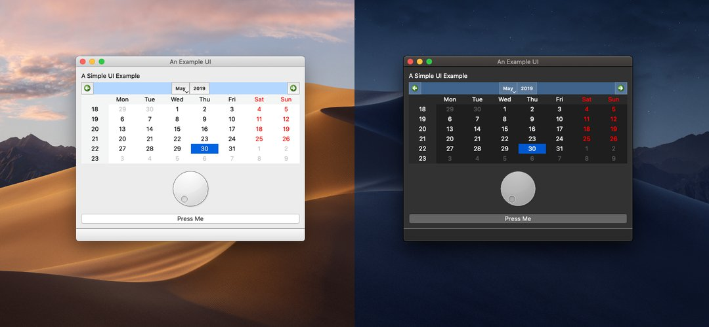

## Having a dark mode is cool

Even though a [dark mode probably isn't as good for your eyes as might think](https://www.wired.co.uk/article/dark-mode-chrome-android-ios-science), 
letting the user choose between a dark and a light theme is a nice feature. The biggest driver is **aesthetics** : 
dark themed interfaces just look better in my opinion. 



Other reasons are better battery life and less blue light for bedtime reading. If you're just starting a website, it's 
a good idea to implement it right away because the bigger the project gets, the harder it will be to set this up.

## #1 : gatsby-styled-components-dark-mode 

We are going to take advantage of [gatsby plugins]() to make our life easier.

The first one we are going to be using is called *gatsby-styled-components-dark-mode*.

> A Gatsby plugin that handles injecting a dark and light theme, as well as functionality for toggling between them. 
> It also persists the state of your users’ dark option in their browsers.

Follow install and setup instructions [here](https://www.gatsbyjs.org/packages/gatsby-styled-components-dark-mode/).

## #2 : Syntax highlighting for your code blocks with PrismJS

The tricky part when implementing a dark mode are code blocks.
On *Brocolli*, blog posts are written in Markdown, and parsed and transformed into beautiful html pages with 
[Remark](https://www.gatsbyjs.org/packages/gatsby-transformer-remark/).
The code blocks in your markdown file are syntax highlighted with [PrismJS](https://www.gatsbyjs.org/packages/gatsby-remark-prismjs/).

You need both those Gatsby plugins to make this solution work.

Here is the trick : you need to create custom styles for the code syntax highlighting of your dark and light themes. 
For example, here are the `.css` files for the [light](https://github.com/benjamin-vaysse/brocolli/blob/master/src/vendors/prism/prism.css) 
and the [dark](https://github.com/benjamin-vaysse/brocolli/blob/master/src/vendors/prism/prism-dark.css)
themes for this blog. You can download such files [here](https://prismjs.com/download.html).

Now, the important thing : before every selector in your dark theme `.css` file, add the following selector :   `html[displayMode='dark']` .

```css
.token.tag {
  color: #e06c75;
}
```

thus becomes 

```css
html[displayMode='dark'] .token.tag {
  color: #e06c75;
}
```

Then, in your layout file, get the current theme with `useContext` : 

```javascript
const themeContext = useContext(ThemeManagerContext);
const displayMode = themeContext.isDark ? "dark" : "light";
``` 

and apply it to your document's head with [react-helmet](https://www.gatsbyjs.org/packages/gatsby-plugin-react-helmet/): 
```javascript
<Helmet htmlAttributes={{ displayMode }} />
```

As you switch the theme on your website, the `<html>` tag will be updated with the `displaymode = "light"` or `displaymode = "dark"`
attributes, and the appropriate styling will automatically be applied.

## #3 Use the dark theme by default

In your layout file : 

```javascript
const themeContext = useContext(ThemeManagerContext);
useEffect(() =>
    themeContext.toggleDark(window.localStorage.getItem('dark') === "true"),
    //the localStorage item "dark' is handled by `gatsby-styled-components-dark-mode`
[]);
```

### #4 That's about it

I wrote this article after reading [this conversation on spectrum](https://spectrum.chat/gatsby-js/general/prismjs-syntax-highlighting-with-mode-light-vs-dark-toggle~0ee962a1-501c-4879-960a-242f85387d1c).
The original solution comes from **tetchi**, check out his [blog](https://www.tetchi.ca/) or how he implemented this on his [github](https://github.com/Tetsuro/tetsby).

You can also have a look at the implementation of this solution on my blog [here](https://github.com/benjamin-vaysse/brocolli).

If you have any questions, google is your friend.

Peace out ✌️