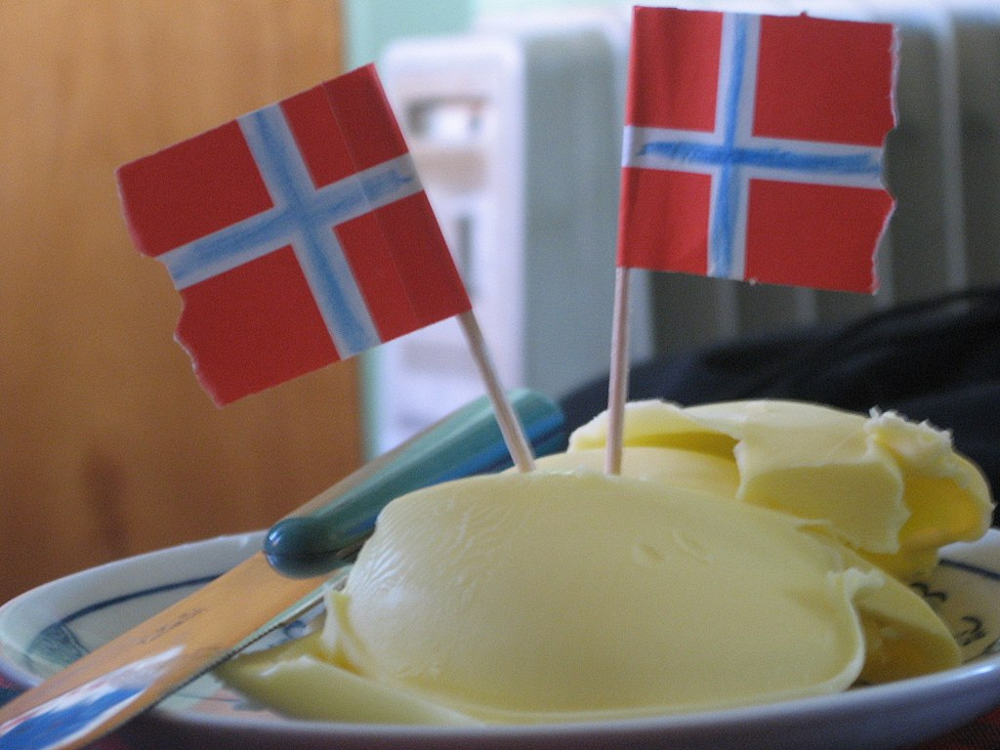

This is my first blog post. Just fumbling around.

I'm still unsure what topics this blog will cover.

Meanwhile, here's a great quote from this Wikipedia on
[the late-2011 norwegian butter-crisis](https://en.wikipedia.org/wiki/Norwegian_butter_crisis).

> The Norwegian butter crisis began in late 2011 with an
> acute shortage of butter and inflation of its price
> across markets in Norway. The shortage caused soaring
> prices and stores' stocks of butter ran out within minutes
> of deliveries. According to the Danish tabloid B.T.,
> Norway was gripped by smør-panik ("butter panic") as a
> result of the butter shortage..

