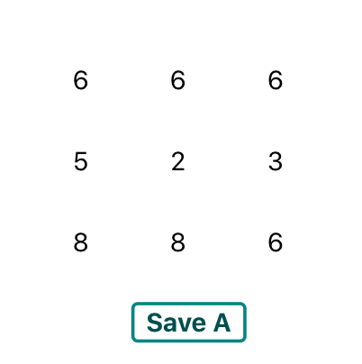
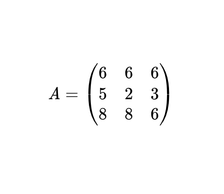

## Prerequisites

For this example, we'll be handling state with **hooks**. If you're not familiar with hooks, check
[React's Docs](https://reactjs.org/docs/hooks-intro.html). It's the future of React and it'll make your life easier
so don't think twice about it.

If you want to display your matrix in LaTex, you'll also have to install [`katex`](https://katex.org/docs/node.html)
and [`react-katex`](https://www.npmjs.com/package/react-katex).

## Parent component

In the parent component, we'll be declaring different states for

1. The size of the matrix (object with 'columns' and 'rows' attributes).
2. The matrix itself (a two dimensional array == an array of array(s)).
3. The KaTeX string associated with the matrix.

```jsx
const [matrixSize, setMatrixSize] = useState({
  rows: 2,
  columns: 2,
})
// or, if it's a square matrix :
// const [squareMatrixSize, setSquareMatrixSize] = useState(2);
const [matrix, setMatrix] = useState([[0, 0], [0, 0]])
const [latexMatrix, setLatexMatrix] = useState(
  "\\begin{pmatrix}\n 0 & 0\\\\\n 0 & 0\n \\end{pmatrix}",
)
```

## Matrix Size Input Component

The first step is to let the user choose the size of the matrix. We thus create a component that takes as props
the `setMatrixSize` function.

```jsx
<MatrixInputSize setMatrixSize={object => setMatrixSize(object)} />
```

Here's what the `MatrixInputSize` input should look like :

```jsx
<input
  type="number"
  defaultValue={2}
  onChange={e => {
    const rows = parseInt(e.target.value)
    // if we only want matrix of size between 2 and 8
    if (2 <= rows && rows <= 8) {
      setMatrixSize(prevSize => ({
        ...prevSize,
        rows: rows,
      }))
    }
  }}
/>
```

We use [object destructuring](https://developer.mozilla.org/en-US/docs/Web/JavaScript/Reference/Operators/Destructuring_assignment)
to set the new value of the `matrixSize` state while keeping the value we are not changing (here we change the number of
rows without changing the number of columns).

## Matrix Input Component

Now for the real deal, **how do we dynamically create the different inputs and get their values to update the `matrix`
state ?**

We create a new component : `MatrixInput`.

```jsx
<MatrixInput matrixSize={matrixSize} setMatrix={matrix => setMatrix(matrix)} />
```

Inside this component, we'll be creating a new variable called `matrix`, which we'll use to build the inputs.

```javascript
let matrix = Array(matrixSize.rows)
for (let i = 0; i < matrixSize.rows; i++) {
  matrix[i] = new Array(matrixSize.columns).fill(0)
}
```

We then build our form with the `map()` function o

```jsx
<form onSubmit={handleSubmit}>
  {matrix.map((row, indexRow = 1) => {
    return (
      <MatrixRow key={indexRow}>
        {row.map((item, indexColumn = 1) => {
          return (
            <input
              key={indexRow + " " + indexColumn}
              type="text"
              defaultValue={0}
              name={indexRow + "," + indexColumn}
            />
          )
        })}
      </MatrixRow>
    )
  })}
  <button>{"Save A"}</button>
</form>
```

You just have to define `<MatrixRow>` as a flex-container (css : `display: flex;`) and you'll have `n` rows of `m` 
elements.




The last step is to get the values from the form and update the `matrix` state with those values. We're actually able to 
loop through the inputs of the form with `event.target[count]`, which is really useful in this case.

```javascript
const handleSubmit = event => {
    event.preventDefault();
    let count = 0;
    for (let i = 0; i < matrixSize.rows; i++) {
      for (let j = 0; j < matrixSize.columns; j++) {
        // If the floating point number cannot be parsed, we set 0 for this value
        matrix[i][j] = !isNaN(parseFloat(event.target[count].value)) ? parseFloat(event.target[count].value) : 0;
        count += 1;
      }
    }
    setMatrix(matrix);
}
```

## Matrix rendering with `react-katex`

In the parent component, let's set a `useEffect` with `matrix` as a dependency so that when the `matrix` state is modified,
we update the `latexMatrix` with the right values.

```jsx
useEffect(() => {
  setLatexMatrix(renderLatexMatrix(matrix))
  // + do any action you want on the matrix
}, [matrix])
```

As you can see, we're using a function called `renderLatexMatrix`. This function transforms a matrix into a string
readable by `react-katex` to be displayed in the browser in a LaTeX manner.

Here is this function :

```jsx
const renderLatexMatrix = matrix => {
  return (
    "\\begin{pmatrix}\n" +
    matrix
      .map((row, index) => {
        if (index === matrix.length) return row.join(" & ") + "\n"
        else return row.join(" & ") + "\\\\\n"
      })
      .join("") +
    "\\end{pmatrix}"
  )
}

export default renderLatexMatrix
```

Then, we render the matrix :

```javascript
 <BlockMath math={"A = " + latexMatrix} />
```



**Isn't that beautiful ?**
